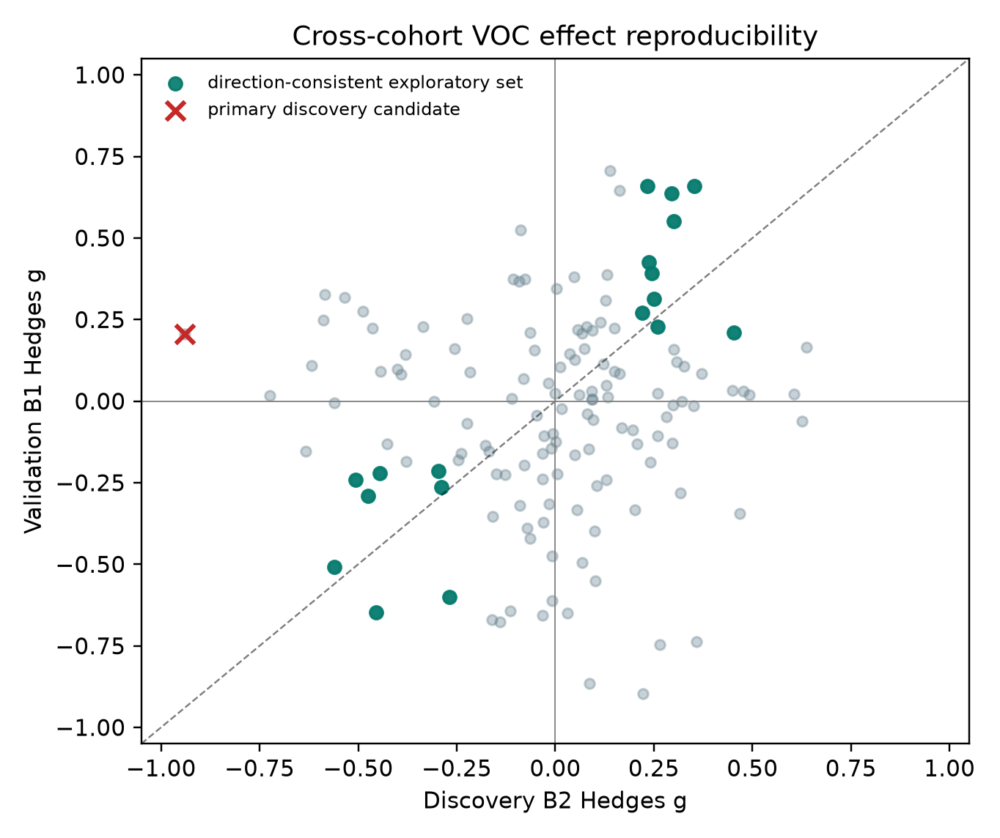
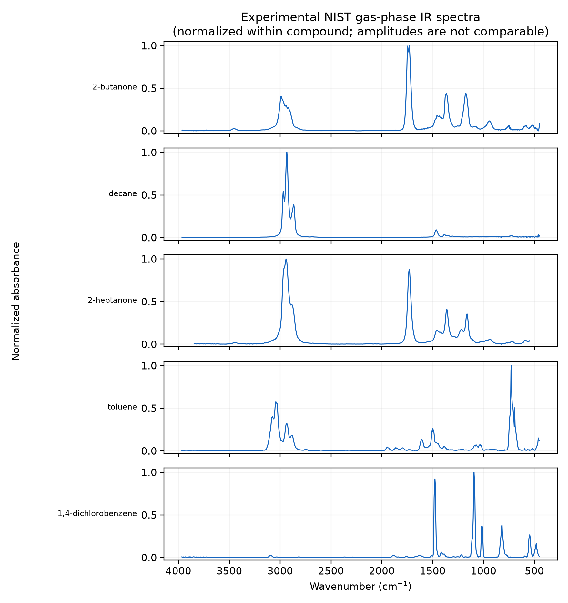
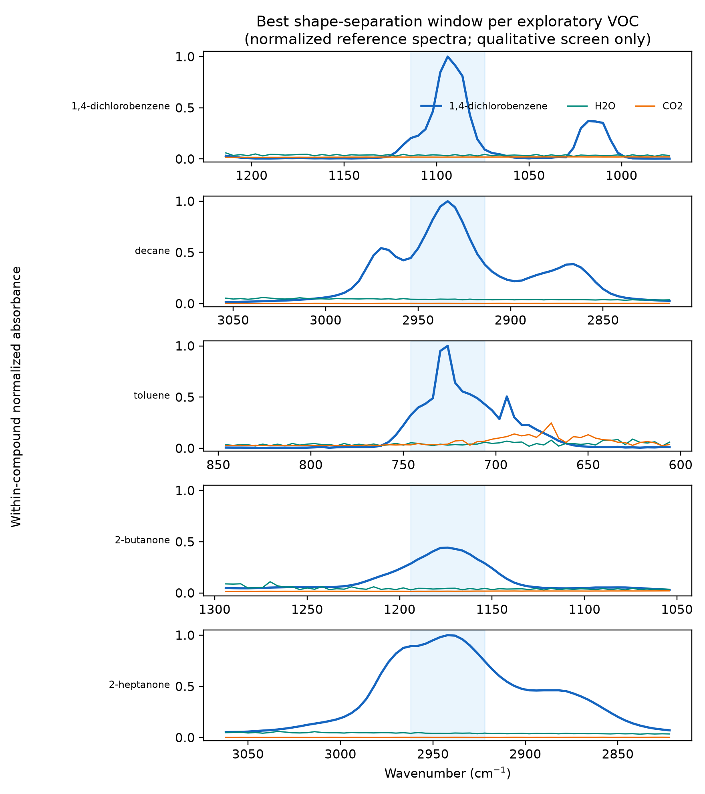
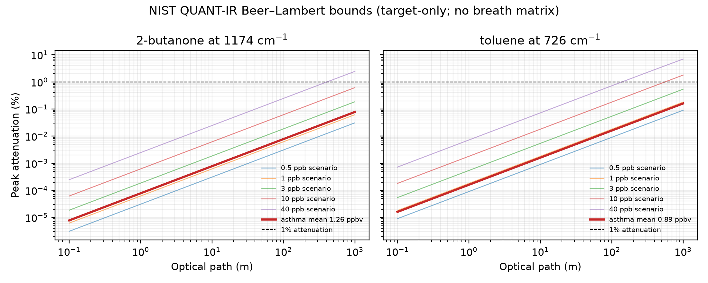

# From Breathomics to Photonic Targets

This project asks one engineering question:

> Which asthma-associated breath volatile organic compounds (VOCs) are reproducible across independent cohorts and also plausible targets for compact mid-infrared sensing?

The first milestone is deliberately narrow: download and audit the public RADicA breathomics release before choosing any statistical model.

## Planned evidence chain

1. Audit the clinical breathomics files, metadata, licence, cohorts, labels, compounds, missing values, and ambient-air matching.
2. Correct breath signals using matched ambient-air samples.
3. Select candidates in a discovery cohort and test effect direction in an untouched validation cohort.
4. Match validated candidates to experimental gas-phase IR reference spectra.
5. Rank candidates by clinical reproducibility, spectral selectivity against H2O/CO2, and measurement complexity.

The project will keep three evidence types separate:

- patient breath GC-MS data: which VOCs may be clinically relevant;
- experimental pure-gas IR spectra: where compounds absorb;
- physics-based simulations: how humidity, CO2, resolution, noise, and drift may affect a sensor.

## Quick start

```bash
python -m venv .venv
source .venv/bin/activate
pip install -e '.[dev]'
python -m breath_to_photonics.audit data/raw --output results/data_audit.json
pytest
```

Raw public data are not committed. See `data/SOURCES.md` for provenance and download status.

For the distinction between the original plan, evidence-driven adjustments, and remaining work, see `docs/STATUS_AND_ROADMAP_2026-09-06.md`.

## Current status

The manually downloaded RADicA release passed the structural audit: 112 participants, 346 participant-visits, matched MaskBG/S1/S2 samples, and 142 shared processed VOC columns across B1 and B2. See `docs/DATA_AUDIT_2026-09-06.md`.

The locked v0.1 analysis uses B2 for discovery and B1 for validation. Three participants appearing in both files are removed from validation, and repeated visits are averaged within participant before testing. See `configs/analysis_v0.1.json`.

The primary analysis found no VOC meeting the locked cross-cohort replication rule. This negative result and the explicitly exploratory follow-up are documented in `docs/PRELIMINARY_RESULTS_2026-09-06.md`.



Five exploratory candidates currently have verified experimental gas-phase NIST spectra. The spectra are normalized only for band-location inspection; their amplitudes cannot be compared across compounds. See `docs/SPECTRAL_AUDIT_2026-09-06.md`.



A qualitative interference screen compares those normalized target shapes with gas-phase H2O and CO2 references. It identifies candidate windows for further study, but does not establish selectivity, sensitivity, concentration response, or detection limits. See `docs/INTERFERENCE_SCREEN_2026-09-06.md`.



NIST QUANT-IR provides compatible absorption coefficients for two of the five exploratory targets: 2-butanone and toluene. At independent literature asthma means of 1.26 and 0.89 ppbv, respectively, a target-only Beer–Lambert bound predicts only about 0.000780% and 0.00161% peak attenuation over 10 m. The concentration evidence comes from a small eight-person asthma subgroup, and the calculations remain bounds rather than detection limits. See `docs/QUANTITATIVE_BOUNDS_2026-09-06.md`.


