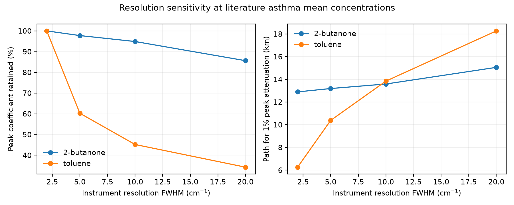
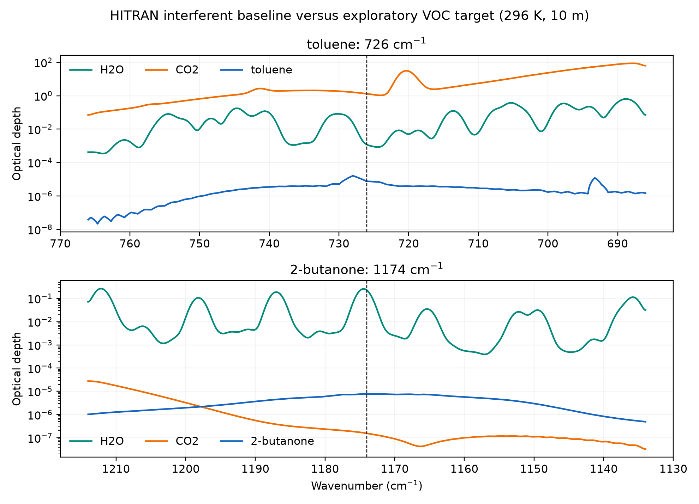
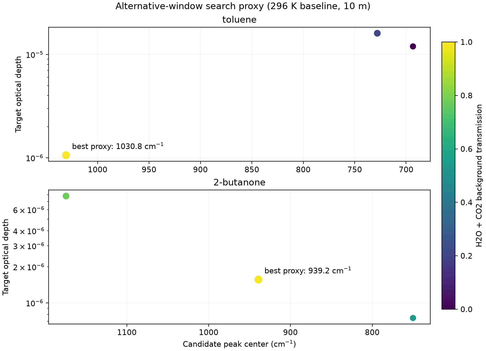
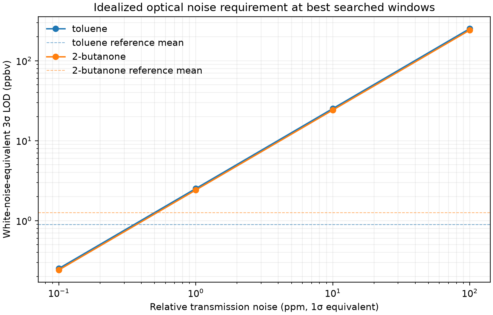
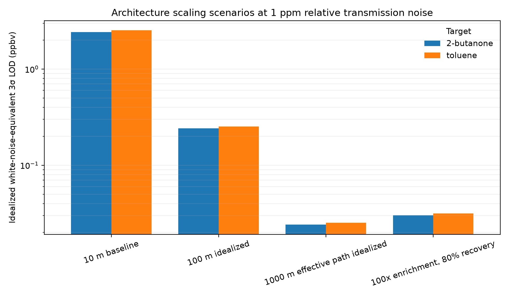
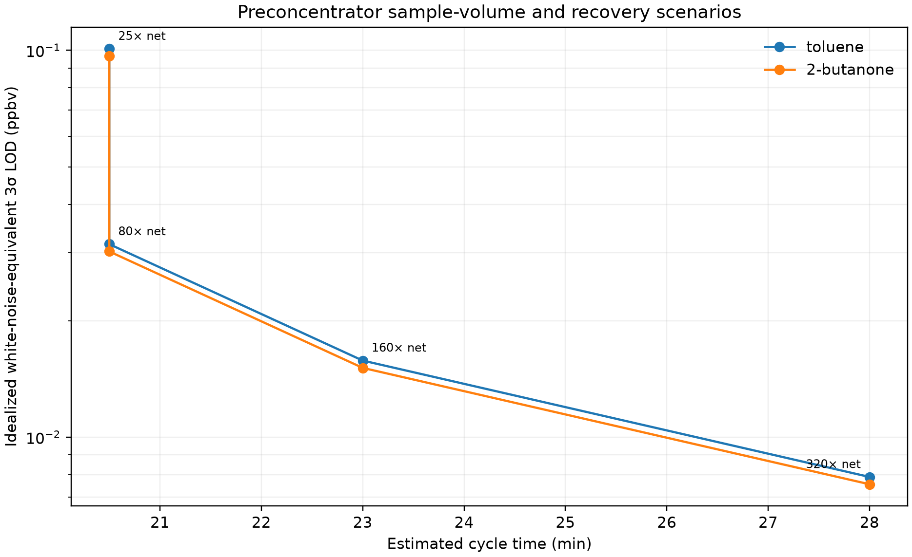

# From Breathomics to Photonic Targets

This project asks one engineering question:

> Which asthma-associated breath volatile organic compounds (VOCs) are reproducible across independent cohorts and also plausible targets for compact mid-infrared sensing?

The first milestone is deliberately narrow: download and audit the public RADicA breathomics release before choosing any statistical model.

## Planned evidence chain

1. Audit the clinical breathomics files, metadata, licence, cohorts, labels, compounds, missing values, and ambient-air matching.
2. Correct breath signals using matched ambient-air samples.
3. Select candidates in a discovery cohort and test effect direction in an untouched validation cohort.
4. Match validated candidates to experimental gas-phase IR reference spectra.
5. Rank candidates by clinical reproducibility, spectral selectivity against H2O/CO2, and measurement complexity.

The project will keep three evidence types separate:

- patient breath GC-MS data: which VOCs may be clinically relevant;
- experimental pure-gas IR spectra: where compounds absorb;
- physics-based simulations: how humidity, CO2, resolution, noise, and drift may affect a sensor.

## Quick start

```bash
python -m venv .venv
source .venv/bin/activate
pip install -e '.[dev]'
python -m breath_to_photonics.audit data/raw --output results/data_audit.json
pytest
```

Raw public data are not committed. See `data/SOURCES.md` for provenance and download status.

For the distinction between the original plan, evidence-driven adjustments, and remaining work, see `docs/STATUS_AND_ROADMAP_2026-09-06.md`.

For the final computational-stage go/no-go decision, see `docs/CONSOLIDATED_DECISION_2026-09-07.md`.

## Current status

The consolidated decision is **not to build an asthma-diagnostic photonic instrument from the current targets**. The analysis is nevertheless useful: it is a reproducible negative feasibility result that identifies failures in clinical replication, compound-level identity confirmation, and atmospheric-window selectivity before hardware expenditure. Only a small, non-diagnostic benchtop preconcentrator validation remains conditionally justified; without laboratory hardware and certified standards, the project can defensibly stop at this result. See `docs/CONSOLIDATED_DECISION_2026-09-07.md` and `results/decision_gates.csv`.

The manually downloaded RADicA release passed the structural audit: 112 participants, 346 participant-visits, matched MaskBG/S1/S2 samples, and 142 shared processed VOC columns across B1 and B2. See `docs/DATA_AUDIT_2026-09-06.md`.

The locked v0.1 analysis uses B2 for discovery and B1 for validation. Three participants appearing in both files are removed from validation, and repeated visits are averaged within participant before testing. See `configs/analysis_v0.1.json`.

The primary analysis found no VOC meeting the locked cross-cohort replication rule. This negative result and the explicitly exploratory follow-up are documented in `docs/PRELIMINARY_RESULTS_2026-09-06.md`.


Five exploratory candidates currently have verified experimental gas-phase NIST spectra. The spectra are normalized only for band-location inspection; their amplitudes cannot be compared across compounds. See `docs/SPECTRAL_AUDIT_2026-09-06.md`.


A qualitative interference screen compares those normalized target shapes with gas-phase H2O and CO2 references. It identifies candidate windows for further study, but does not establish selectivity, sensitivity, concentration response, or detection limits. See `docs/INTERFERENCE_SCREEN_2026-09-06.md`.


NIST QUANT-IR provides compatible absorption coefficients for two of the five exploratory targets: 2-butanone and toluene. At independent literature asthma means of 1.26 and 0.89 ppbv, respectively, a target-only Beer–Lambert bound predicts only about 0.000780% and 0.00161% peak attenuation over 10 m. The concentration evidence comes from a small eight-person asthma subgroup, and the calculations remain bounds rather than detection limits. See `docs/QUANTITATIVE_BOUNDS_2026-09-06.md`.


Resolution broadening from approximately 2 to 20 cm⁻¹ retains about 86% of the selected 2-butanone peak but only 34% of the narrower toluene peak. See `docs/RESOLUTION_SENSITIVITY_2026-09-06.md`.



A cross-study concentration audit confirms a low-ppbv regime and, importantly, shows that 2-butanone and toluene can be comparable to or lower than room-air levels. Any eventual instrument must therefore support paired background measurement rather than absolute breath-only sensing. See `docs/CONCENTRATION_EVIDENCE_2026-09-06.md`.

The manually downloaded HITRAN2024 H2O/CO2 lines enable a first quantitative interferent baseline. Under the declared 296 K, 1 atm, 5% H2O, 4% CO2, 10 m, and 2 cm⁻¹ assumptions, both exploratory windows are dominated by interferent optical depth. This baseline intentionally omits temperature rescaling, line mixing, water continuum, and non-Voigt effects, so it is a rejection screen rather than a final instrument simulation. See `docs/HITRAN_INTERFERENCE_BASELINE_2026-09-07.md`.



A full search within the downloaded 650–1250 cm⁻¹ range finds lower-opacity alternatives near 1030.75 cm⁻¹ for toluene and 939.20 cm⁻¹ for 2-butanone. Even there, interferent optical depth remains roughly 7,150 and 6,240 times the target signal, respectively; these are search candidates rather than viable windows. See `docs/ALTERNATIVE_WINDOW_SEARCH_2026-09-07.md`.



The RADicA method required NIST 2023 mass-spectral similarity ≥80 and retention-index agreement within ±20 for named compounds. However, the public files do not identify which individual VOCs belong to the 60 authentic-standard-confirmed MSI Level 1 entries versus the 247 Level 2 annotations. The five exploratory identities are therefore provisional for sensor design. See `docs/CHEMICAL_IDENTITY_AUDIT_2026-09-07.md` and `results/identity_confidence.csv`.

At the best searched windows, the literature-mean target signals over 10 m are only about 1.06 ppm of transmission for toluene and 1.56 ppm for 2-butanone. A 3σ observation therefore requires idealized 1σ relative transmission noise below 0.353 and 0.522 ppm, respectively, while the combined H2O/CO2 optical-depth baseline must reproduce to roughly 47–53 ppm of its own value. These are necessary precision bounds, not demonstrated limits of detection. See `docs/NOISE_AND_DRIFT_BUDGET_2026-09-07.md`.



An idealized architecture comparison shows that a 1000 m effective cavity can lower the white-noise-equivalent LOD if its noise is held fixed, but it does not relax the required H2O/CO2 background repeatability. A 100× preconcentration scenario with 80% target recovery and 1% residual atmospheric background gives a slightly higher modeled LOD of about 0.030–0.032 ppbv while improving target-to-atmospheric-background contrast by 8000×. The assumptions are sensitivity scenarios, not demonstrated device performance. See `docs/ARCHITECTURE_COMPARISON_2026-09-07.md`.



A preconcentrator mass balance translates the preferred hybrid scenario into a 500 mL sample, 5 mL desorption volume and 80% recovery. It predicts an 80× net enrichment, low-ng recovered target masses, approximately 71–101 ppbv desorbed concentrations and a 20.5 minute idealized cycle. These values define a benchtop recovery and breakthrough experiment; they do not demonstrate sorbent performance. See `docs/PRECONCENTRATOR_MASS_BALANCE_2026-09-07.md`.



A locked 115-run benchtop protocol now tests the reference preconcentrator across 0.1–10 ppbv, dry to 90% RH, 0.5–2 L sample volumes, seven carryover pairs and dedicated atmospheric-residual measurements. Passing requires 70–130% recovery, ≤20% RSD, ≤0.02 ppbv blanks, ≤5% breakthrough at 500 mL and removal of at least 99% of the modeled H2O/CO2 optical depth. See `docs/BENCHTOP_VALIDATION_PROTOCOL_2026-09-07.md` and `results/benchtop_run_plan.csv`.

An automated evaluator now checks completed run plans without substituting missing values. It calculates recovery, precision, humidity bias, low-level MDL, blanks, carryover, breakthrough, atmospheric residual and flow/volume errors, then returns `pass`, `conditional_pass`, `fail`, or `not_evaluable`. The current empty template correctly remains `not_evaluable`. See `docs/BENCHTOP_EVALUATOR_2026-09-07.md`.
