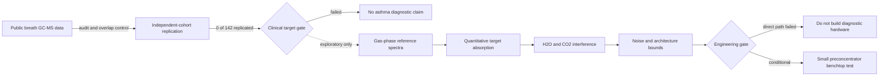

# From Breathomics to Photonic Targets

## An evidence-gated feasibility study for asthma breath sensing

### Research question

Can volatile organic compounds reported in asthma breathomics be converted into defensible molecular targets for compact mid-infrared photonic sensing?

### Why this matters

Biomedical sensors often move too quickly from a statistically interesting molecule to an instrument concept. A usable target must survive several independent tests: clinical replication, chemical identification, quantitative spectroscopy, atmospheric interference, and realistic measurement noise. This project built a reproducible workflow that tests those conditions before hardware development.

### What I built

- An audited analysis of the public RADicA GC-MS release, including detection and removal of three participants shared between discovery and validation files.
- A locked, participant-level cross-cohort replication analysis covering 142 VOC features.
- A curated gas-phase spectral workflow using NIST reference spectra and quantitative QUANT-IR data where available.
- Beer–Lambert, HITRAN H2O/CO2 interference, spectral-resolution, noise/drift, architecture, and preconcentrator mass-balance models.
- A versioned nine-gate go/no-go framework, a 115-run benchtop protocol, and an automated acceptance evaluator that does not silently impute missing measurements.

### Evidence chain

### Main findings

The public dataset was structurally usable after overlap mitigation, but none of the 142 tested VOCs passed the predeclared cross-cohort replication rule. Five exploratory compounds had verified gas-phase reference spectra, while only 2-butanone and toluene had compatible quantitative spectra. Their best modelled windows within 650–1250 cm⁻¹ remained dominated by H2O and CO2, with interferent-to-target optical-depth ratios of approximately 6,236:1 or higher.

At literature-mean asthma concentrations, the strongest 10 m target attenuation was approximately 1.56 parts per million in relative transmission. A direct-path instrument was therefore not supported. Preconcentration improved the modelled target-to-atmospheric-background contrast, but its recovery, humidity tolerance, breakthrough, blank, and carryover performance remain experimental unknowns.

### Decision and significance

The result is a reproducible negative feasibility finding: the present evidence does not justify an asthma-diagnostic photonic instrument. This is not a failed analysis. The workflow identified three upstream blockers—clinical replication, compound-level identity confirmation, and atmospheric selectivity—before expensive optical integration.

A limited preconcentrator study remains justified as a non-diagnostic measurement-method experiment. The diagnostic route should reopen only after an independently replicated VOC is confirmed with an authentic standard and passes quantitative sensing gates.

### Skills demonstrated

Clinical metabolomics data auditing; leakage-aware validation; reproducible Python analysis; experimental and quantitative spectral curation; HITRAN line-by-line modelling; optical noise budgeting; multi-constraint engineering decisions; preregistered acceptance criteria; scientific communication of negative results.

### Reproducibility

The repository contains versioned assumptions, machine-readable decision gates, generated result tables and figures, a complete test suite, and documentation that distinguishes observations from simulations. Raw third-party data are excluded from version control and documented through provenance records.
